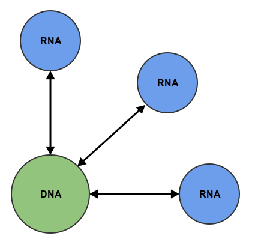
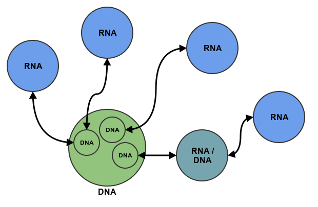

# DNA

*This is a highly experimental project.  If you're intrigued, try it out or drop me a line.  For now, DNA is being developed in Python.  It may be extended to other languages in the future.*

## Introduction & Purpose

When data-rich applications reahch a certain critical mass, a lot of the design effort is spent on propagating the data through the application.  This is especially the case in graphical applications.  For example, take a financial application.  The core data is probably a list of transactions, containing amounts, dates, and other information.  This data is summarized and displayed in a number of ways.  For example, one widget may display all the transactions to/from a specific account.

If the data is changed in any way, all the widgets depending on it need to be updated.  It can be difficult or time-consuming to create a straightforward data flow from all the dependencies.  DNA is designed for just such a case.

## Design Overview & Philosophy

The application's master data-set is stored in the DNA instance.  Any number of RNA instances can be linked to the DNA instance.  Each RNA instance constitutes a particular *expression* of the master data.

For example, if the master data is a list of people's names, ages, and favorite kind of pie, one RNA may display a pie chart of favorite pie types, one RNA may display a pie chart of ages, and the final RNA may simply display the number of people in the list.

In practice, the design will often be more complicated, as shown below:

Here the master data-set is broken into smaller chunks.  Each chunk may have multiple expressions.  It is also possible to combine DNA and RNA behavior into one object.

## Requirements

  * DNA
    * Support linking to arbitrary number of RNA objects.
    * __Do not__ provide an interface for editing the data.
    * Support a fully-customizable interface for RNA objects to specify exactly what kind of data changes to the master data should be propagated to them.

  * RNA
    * Whenever possible, draw upon the master data-set instead of duplicating data.
    * Provide a consistent interface for editing the master data-set through the RNA object.
    
  * General
      * DNA and RNA functionality ought to be able to co-exist in one object.

## Inspiration

Inspiration from this project came from biology, Kivy's [properties](http://kivy.org/docs/api-kivy.properties.html), and Blender's [DNA and RNA](http://www.blendernation.com/2008/12/01/blender-dna-rna-and-backward-compatibility/).  Note that, at present, the terms "DNA" and "RNA" have a much different meaning in this project than they do in Blender (and they aren't quite true to biology, either).